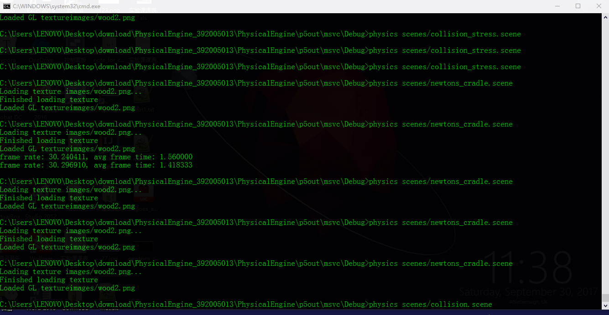
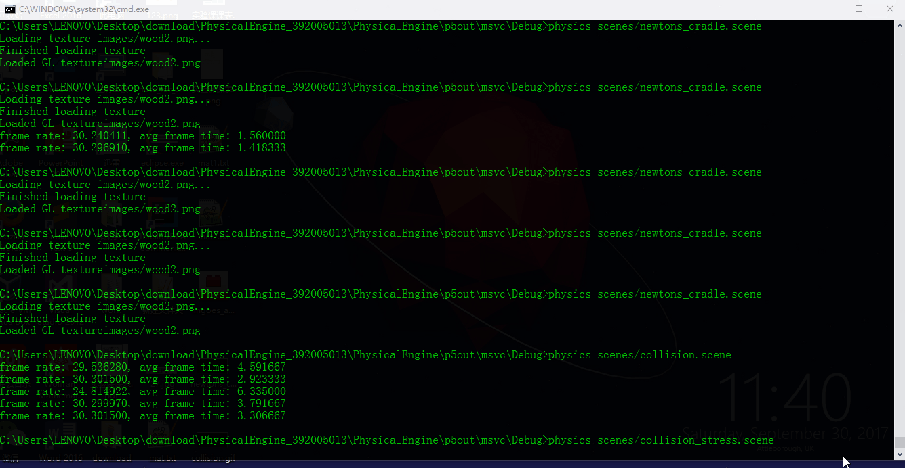
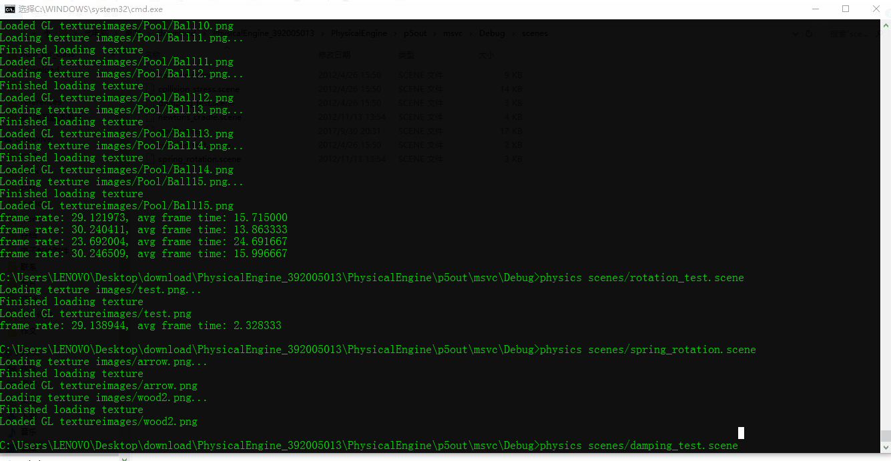
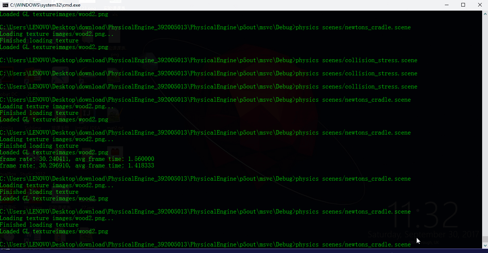
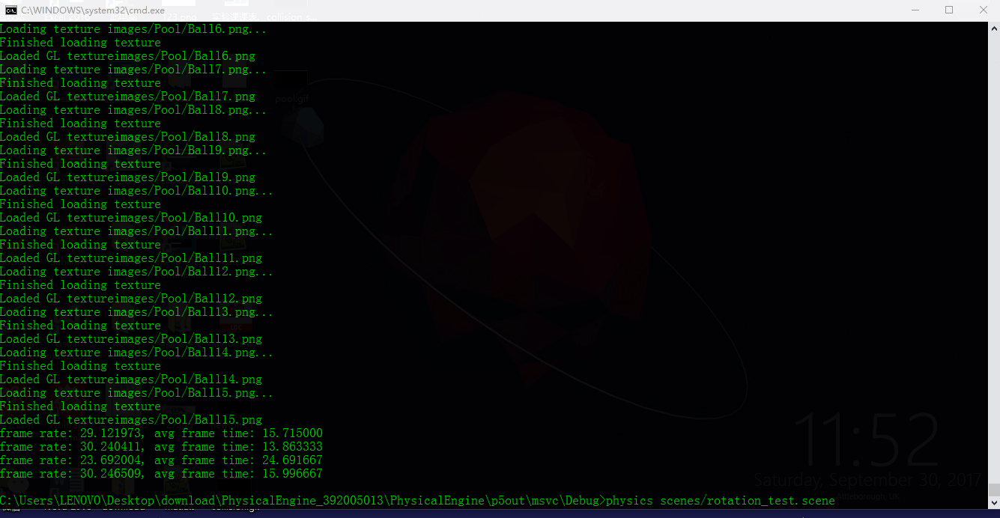
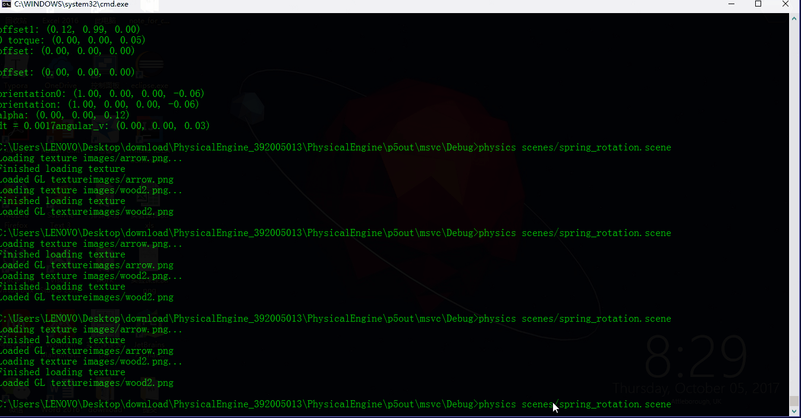
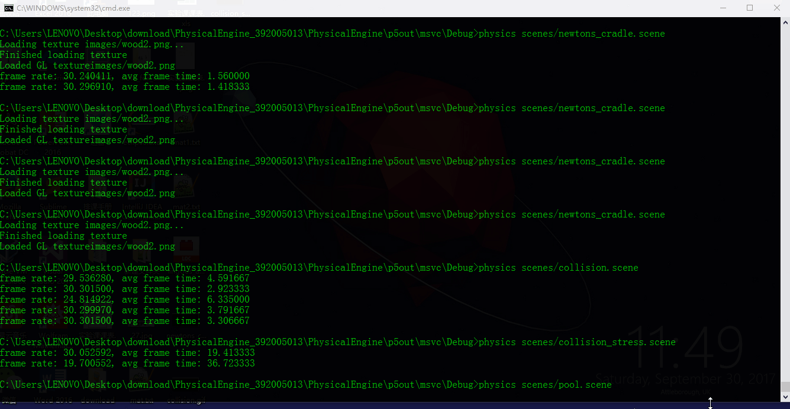

# 简单物理引擎

> 作者： H.Chen (Tinyalpha)
>
> Email: 2366759958@qq.com

-----

### 0.源代码：

* 见 `p5out\msvc\physics.vcproj`

### 1. 实验原理：

* 根据动力学定律描写系统的演化，通过opengl渲染

* 物体的移动和转动在迭代时只保留一阶小量：

  $x(t_0+dt) = x(t_0)+v(t_0)dt$ ,	$v(t_0+dt)=v(t_0)+a(t_0)dt$

  $\omega(t_0+dt)=\omega(t_0)+\alpha(t_0)dt$,	$q(t_0+dt)=r(\omega(t_0)dt)q(t_0)$

* 物体的动力学用牛顿第二定律和转动定律描述：

  $\Sigma F_i = ma$	,		$\Sigma \tau_i=I\alpha$

* 弹簧的弹力由胡克定律（含阻尼）给出：

  $F=-kx-c\frac{dx}{dt}$

* 弹簧`body1_offset` `body2_offset`属性的迭代与物体的`orientation`属性采用相同处理方式：

  $offset(t_0+dt)=r(\omega(t_0)dt) offset(t_0)$

* 物体之间的碰撞根据碰撞定律计算，恢复系数$e=1-collision\_damping$

### 2. 实验步骤：

* 编译
* 切换到可执行文件所在路径
* 命令行输入：`physics <scene文件>`

### 3. 实验效果：

* collision:
* collision_stress:
* damping_test:
* newtons_cradle:
* rotation_test:
* spring_rotation:
* pool:
* 注：在实现pool时修改了scene文件，为母球添加了纵向的初速度

### 4. 实验环境：

* 依赖的库：GLUT3.7, SOIL, GLEW
* 操作系统：Windows 10 Home
* IDE: Visual Studio 2012

